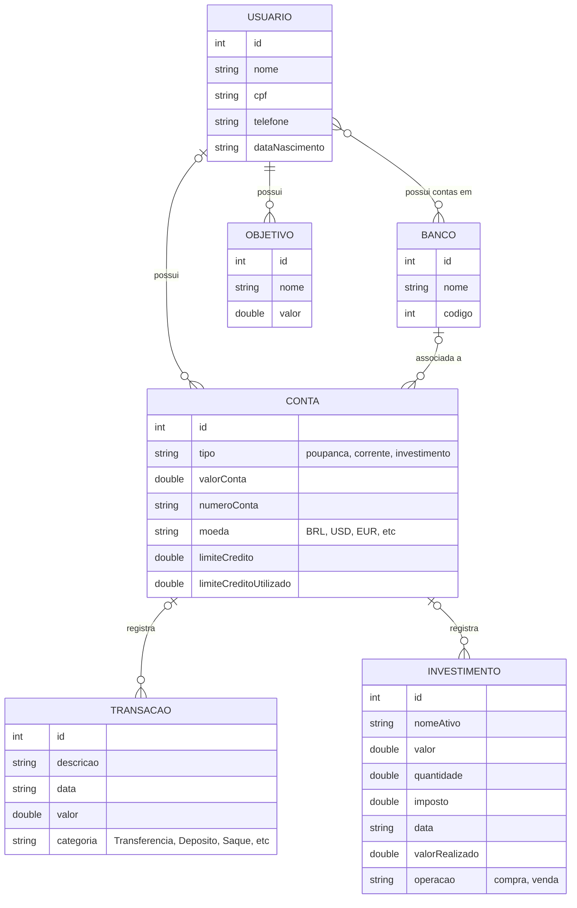

# Modelo de Relacionamento de Entidades - (ERM)

## Subtipos de Transacao
- Debito: tipo (credito, avista)
- Credito

## Subtipos de Investimento
(com IMPOSTO_PADRAO sobre o ganho na venda do ativo)
- Acao: 15%
- CDB: 15%
- CRA: 0% (isento)
- CRI: 0% (isento)
- Cripto: 15%
- DEB: 15%
- FII: 17,5%
- LCA: 0% (isento)
- LCI: 0% (isento)
- PGBL: 15%
- TesouroDireto: 15%
- VGBL: 15%
