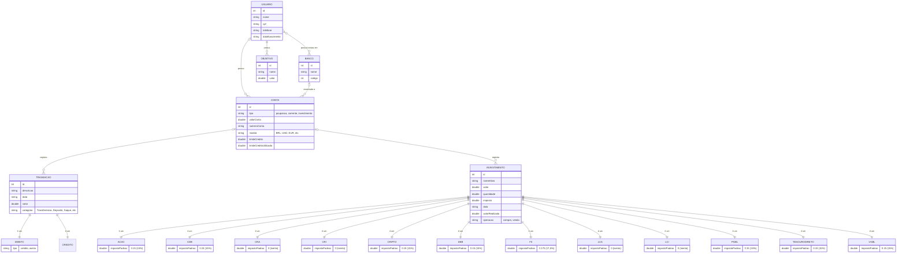

# Modelo de Relacionamento de Entidades - (ERM)

## Heranças (generalização/especialização)

O Mermaid `erDiagram` não possui notação nativa para herança, então as
relações `"é um"` acima representam generalização/especialização
(subtipos), não associações entre instâncias distintas:

- `DEBITO` e `CREDITO` são subtipos de `TRANSACAO` e herdam todos os seus
  atributos (`id`, `descricao`, `data`, `valor`, `categoria`). `DEBITO`
  adiciona o atributo próprio `tipo`. `CREDITO` não adiciona atributos
  próprios.
- `ACAO`, `CDB`, `CRA`, `CRI`, `CRIPTO`, `DEB`, `FII`, `LCA`, `LCI`, `PGBL`,
  `TESOURODIRETO` e `VGBL` são subtipos de `INVESTIMENTO` e herdam todos os
  seus atributos. Cada subtipo não adiciona atributos de instância, apenas
  define a constante `impostoPadrao`, usada no cálculo do imposto sobre o
  ganho de capital em operações de venda.
